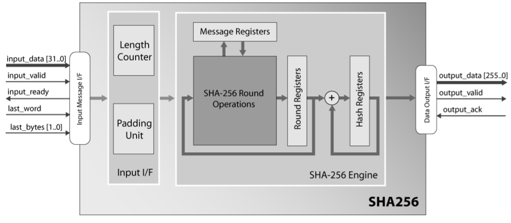

# BitcoinMiningAlgorithm

### Changjun Lim

### December, 2017

*This project is the final project of Computer Architecture class.*

### Abstract
This project is about implementing Bitcoin Mining Algorithm using Verilog. Bitcoin is a representative peer-to-peer cryptocurrency. The key feature of Bitcoin is that the Bitcoin network can assure the reliability of transactions without a central control system. Every record of transactions is stored in blocks and each block is validated with proof of work. It is called Bitcoin mining to ensure the validity of a block by doing a time-consuming process(which needs many calculations).
Bitcoin mining is like solving cryptographical problems within the appointed amount of time and it needs repetitive and fast calculation. So optimizing calculation is important for mining. FPGA is usually better than multi-purpose processors like CPU. In order to execute mining on FPGA, this project implements Bitcoin Algorithm in Verilog.

### Motivation
As the price of 1 Bitcoin(BTC) goes higher than $17,000, cryptocurrency becomes a major issue all over the world and many people dive into Bitcoin mining. And there is a statistics that the power consumption of Bitcoin mining exceeds that of many countries. So this project deals with how the Bitcoin network is working and why Bitcoin mining needs enormous power consumption. Also, since the performance versus power is a major topic in the computer industry, implementing Bitcoin mining will be an interesting engineering problem.

### Objective
- Understand the Bitcoin network and the Bitcoin mining algorithm
- Understand the principle of SHA-256 algorithm
- Implement SHA-256 algorithm in Verilog
- Implement Bitcoin mining algorithm in Verilog

### Principle

#### Hash function
Hash function is the function that maps a message of an arbitrary length to a string of a fixed length. The important features of hash function is that the hash value can be totally changed by a single bit change. Because of this point, we can easily detect the integrity of message. If the hash value of a message is same with the reference hash value, we can assume the message is genuine value.
Even though hash function is not one-to-one function, it is very unlikely to have same hash values with different messages. For instance, SHA-256 has a hash value of 256-bits. the probability of having same hash values is 2-256 ~ 10-77. And since there is no easy way to reverse hash function until now, it is almost impossible to generate fake message with the same hash value.

#### SHA-256 hash
SHA-256 is one of the most popular hash function. It is designed by the United States National Security Agency (NSA). It is one of the SHA-2 hash function which is the next version of SHA-1 hash function. SHA-256 takes a message of any length(even an empty message) and returns a hash values of 256 bits. SHA-256 consists of 3 steps.
1. Prepocessing 
   In this step, a message is converted into a multiple of 512 bits. Assume the length of a message is L bits. Firstly, add '1' bit to end of message and then add '0' padding of which length is the smallest natural number K such that L+1+K(mod 512) = 448(mod 512). After that, add the unsigned integer value of L in 64 bytes. Because of this part, the maximum length of a input message for SHA-256 is 264-1 bits.
2. Message expansion
   Each block of 512 bits are splitted into 16 blocks of 32 bits and then they are expanded to 64 blocks with the smae length in this process.
3. Message compression
   In this step, the hash value of 512 bits are calculated from 64 blocks of 16 bits. It iterates some calculation each block.

### Structure
The following picture is the block diagram for SHA-256. I implemented the SHA-256 Engine part in the figure. The engine part proceeds 2 and 3 steps in SHA-256, which are the processes after preprocessing.

The source code consists of 3 files: sha256_hash.v, sha256_round.v, sha256_round_unit.v.
1. sha256_round_unit.v
This file is for the units used in sha256_round.v
2. sha256_round.v
This file is the module executing SHA-256 round operations. It iterates the step 3 each cycle.
3. sha256_hash.v
This file is the whole SHA-256 calculation except for preprossing.

### Extension
This project does not fully cover all of Bitcoin mining. It is needed to add SHA-256 preprossing and networking of a miner to this project.

#### Reference
- SHA-256 Algorithm: [“Secure Hash Standard (SHS)”, Information Technology Laboratory, National Institute of Standards and Technology](https://csrc.nist.gov/csrc/media/publications/fips/180/2/archive/2002-08-01/documents/fips180-2.pdf)
- Block Diagram: [“SHA-256 Secure Hash Function”, CAST, Inc.](https://www.xilinx.com/publications/3rd_party/products/cast_sha256.pdf)
- ["FPGA Based Bitcoin Mining", Philip Dotemoto](http://digitalcommons.calpoly.edu/cgi/viewcontent.cgi?article=1285&context=eesp)